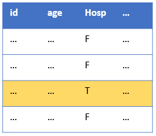
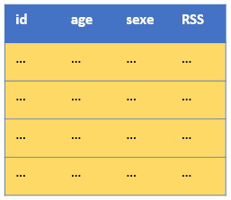
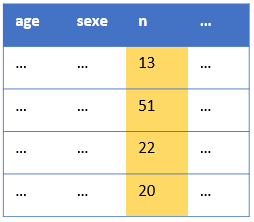
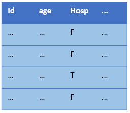
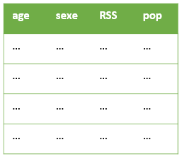
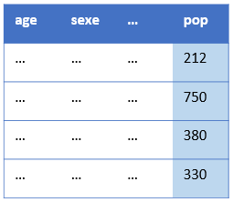
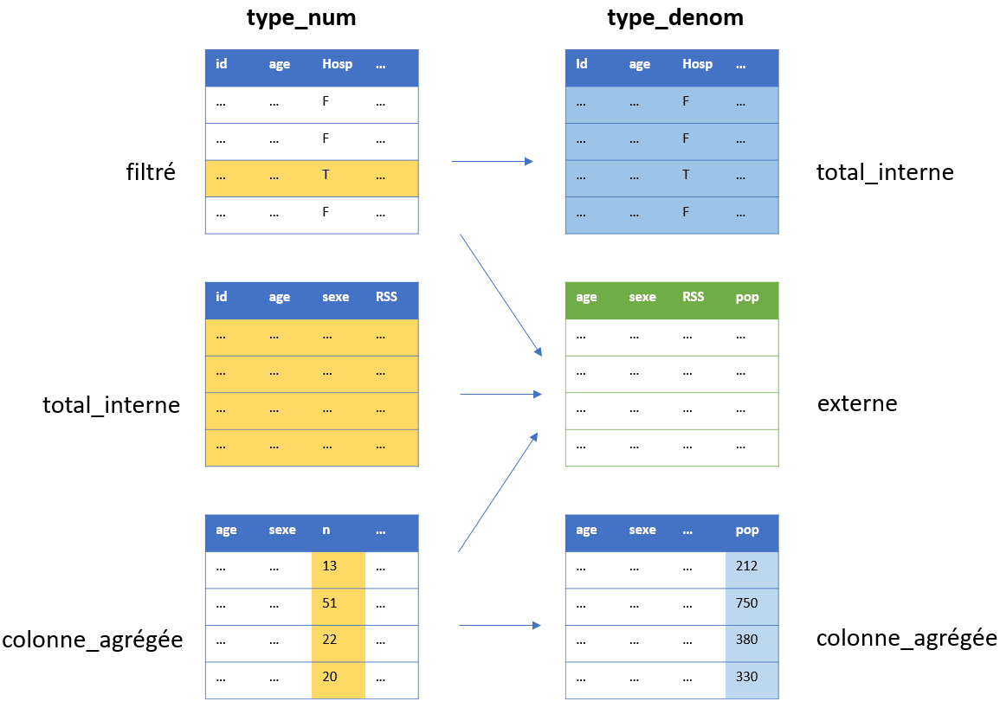

standardisation
================

- [Introduction](#introduction)
  - [Installation](#installation)
  - [Description courte](#description-courte)
  - [Exemples d’utilisation](#exemples-dutilisation)
- [Description détaillée](#description-détaillée)
  - [`agregation`](#agregation)
    - [Regroupement d’âge](#regroupement-dâge)
    - [Structure des données](#structure-des-données)
  - [`standardisation_interne`](#standardisation_interne)
  - [`standardisation_externe`](#standardisation_externe)

# Introduction

Le package **standardisation** comprend un ensemble de fonctions conçues
pour la standardisation et la transformation des données. La
standardisation permet des comparaisons plus fiables entre différentes
populations en ajustant les taux de maladie, de mortalité ou d’autres
indicateurs en tenant compte des différences d’âge, de sexe, ou d’autre
variables. Ce package permet la standardisation en ajustant par une
population de référence soit interne, soit externe. De plus, la fonction
agregation permet de convertir les données individuelles ou
partiellement agrégées en un format propice à la standardisation.

<br>

## Installation

Pour installer à partir de github il faut avoir installé le package
devtools.

``` r
if (!require("devtools")) {
  install.packages("devtools")
}
devtools::install_github("guidopowell/standardisation")
```

## Description courte

Le package comprend trois fonctions principales :

`agregation()` : Cette fonction est conçue pour transformer des données
individuelles ou partiellement agrégées en un format adapté pour les
fonctions de standardisation. Elle peut gérer une large gamme de types
et de formes de données, garantissant une flexibilité pour répondre à
divers besoins d’agrégation de données.

Il convient de noter que les données entièrement agrégées qui répondent
déjà aux exigences des fonctions de standardisation peuvent contourner
cette étape et passer directement à la standardisation.

`standardisation_interne()` : Cette fonction applique une
standardisation interne à des données agrégées. Dans le processus de
standardisation, elle utilise soit la somme des données d’entrée comme
population de référence ou une unité spécifiée par `reference_unite`. La
fonction ajuste pour des facteurs tels que le groupe d’âge, le sexe, et
d’autres variables fournies

La standardisation interne peut-être directe ou indirecte.

`standardisation_externe()` : Cette fonction applique une
standardisation externe à des données agrégées, prenant comme référence
un fichier de données `pop_ref` réprésentant la population du Québec
stratifiée par âge et sexe, à de différentes années et niveaux
géographiques. Cette approche est utile lorsque les données à ajuster ne
sont pas suffisamment représentatif de la population (par exemple une
petite cohorte de patients ayant reçu un nouveau médicamment).

La standardisation externe doit être directe car les numérateurs de la
population référence ne sont pas disponible.

<br>

## Exemples d’utilisation

Voici un exemple simple d’utilisation avec des données simulées de
patients hospitalisés parmi lesquels certains sont décédés (valeur “Oui”
pour la variable `deces`). On veut comparer les taux de décès entre les
régions (RSS) en ajustant pour l’âge. Les détails d’arguments sont
précisés plus bas.

La première étape est d’agréger les données brutes.

``` r
agr<-agregation(donnees = donnees_sim %>% filter(annee == "2022"), 
                   unite = "rss",
                   age = "age",
                   age_cat_mins = c(0,50,60,70),
                   type_num = "filtré",
                   num_filtre_expression = "deces == 'Oui' ",
                   type_denom = "total interne")
```

<br>

Une fois agrégée, les données peuvent être standardisées, dans cet
exemple on fait une standardisation interne et indirecte. Le
regroupement de la variable d’âge de la fonction agregation sort une
variable nommée “AGE_CAT” et des colonnes “num” et “denom” pour les
numérateurs et dénominateurs respectivement.

``` r
st_i<-standardisation_interne(donnees = agr,
                            unite   = "rss",
                            age_cat = "AGE_CAT" ,
                            numerateur = "num",
                            denominateur = "denom",
                            methode = "indirecte",
                            multiplicateur = 100)
```

On peut vérifier l’objet “Resultats” de la standardisation dans la liste
d’objets sortants (l’objet “Details” contient les strates d’agrégation)

``` r

st_i$Resultat
## # A tibble: 15 × 6
## # Groups:   unite [15]
##    unite                              obs   exp ratio IC_bas IC_haut
##    <chr>                            <int> <dbl> <dbl>  <dbl>   <dbl>
##  1 01_Bas-Saint-Laurent                11  23.1 0.476  0.237   0.852
##  2 02_Saguenay-Lac-Saint-Jean          24  23.8 1.01   0.646   1.50 
##  3 03_Capitale-Nationale               67  53.8 1.25   0.966   1.58 
##  4 04_Mauricie et Centre-du-Québec     49  45.4 1.08   0.799   1.43 
##  5 05_Estrie                           42  36.7 1.14   0.825   1.55 
##  6 06_Montréal                        130 135.  0.964  0.805   1.14 
##  7 07_Outaouais                        40  25.6 1.56   1.12    2.13 
##  8 08_Abitibi-Témiscamingue            25  16.0 1.56   1.01    2.30 
##  9 09_Côte-Nord                         6  11.9 0.505  0.185   1.10 
## 10 11_Gaspésie-Îles-de-la-Madeleine     9  10.8 0.832  0.381   1.58 
## 11 12_Chaudière-Appalaches             31  41.9 0.739  0.502   1.05 
## 12 13_Laval                            27  30.9 0.874  0.576   1.27 
## 13 14_Lanaudière                       38  35.3 1.08   0.761   1.48 
## 14 15_Laurentides                      45  52.1 0.864  0.630   1.16 
## 15 16_Montérégie                      113 115.  0.985  0.811   1.18
```

<br>

Et voici ici un exemple d’une standardisation externe et directe. Notez
que les groupes d’âges doivent être spéficiés de nouveau pour permettre
la correspondance avec le dataframe de référence externe. La valeur 99
pour ref_externe_code fait référence au niveau géographique de
l’ensemble du Québec.

``` r

st_e<-standardisation_externe(donnees = agr,
                            unite   = "rss",
                            age_cat = "AGE_CAT" ,
                            age_cat_mins = c(0,50,60,70),
                            numerateur = "num",
                            denominateur = "denom",
                            ref_externe_annee = 2022,
                            ref_externe_code = "99",
                            multiplicateur = 100)
## Warning in standardisation_externe(donnees = agr, unite = "rss", age_cat = "AGE_CAT", : 
## Les groupes d'âge de la population d'analyse sont assumés comme étant équivalents et dans la même ordre que ceux de la population externe de référence.
## Sinon, veuillez modifier les valeurs de vos groupes d'âge
## 
##   Âge.données Âge.externe
## 1      [0,50)      [0,50)
## 2     [50,60)     [50,60)
## 3     [60,70)     [60,70)
## 4    [70,Inf)    [70,Inf)
## Warning in standardisation_externe(donnees = agr, unite = "rss", age_cat = "AGE_CAT", : 
## Le taux ajusté n'est pas calculé pour les unités ayant < 10 observations

st_e$Resultat
## # A tibble: 15 × 7
## # Groups:   rss [15]
##    rss                        n   pop valeur_brute valeur_ajustee IC_bas IC_haut
##    <chr>                  <int> <int>        <dbl>          <dbl>  <dbl>   <dbl>
##  1 01_Bas-Saint-Laurent      11   171         6.43           1.42  0.705    2.53
##  2 02_Saguenay-Lac-Saint…    24   188        12.8            3.60  1.89     5.91
##  3 03_Capitale-Nationale     67   448        15.0            4.28  3.16     5.62
##  4 04_Mauricie et Centre…    49   365        13.4            6.33  3.99     9.22
##  5 05_Estrie                 42   318        13.2            3.56  2.57     4.81
##  6 06_Montréal              130  1048        12.4            5.19  3.79     6.79
##  7 07_Outaouais              40   209        19.1            6.82  4.29    10.0 
##  8 08_Abitibi-Témiscamin…    25   122        20.5            7.49  4.61    11.4 
##  9 09_Côte-Nord               6    97         6.19          NA    NA       NA   
## 10 11_Gaspésie-Îles-de-l…     9    79        11.4           NA    NA       NA   
## 11 12_Chaudière-Appalach…    31   316         9.81           3.92  2.06     6.36
## 12 13_Laval                  27   254        10.6            5.07  2.64     8.33
## 13 14_Lanaudière             38   300        12.7            5.26  3.37     7.68
## 14 15_Laurentides            45   452         9.96           5.59  3.27     8.50
## 15 16_Montérégie            113   909        12.4            4.25  3.22     5.43
```

<br>

<br>

# Description détaillée

Regardons plus en détail les trois fonctions.

## `agregation`

### Regroupement d’âge

La fonction `agregation()` est surtout utile lorsqu’il faut regrouper
des valeurs d’âge continu et compter la somme par groupe. Pour se faire,
il faut spécifier l’argument `age_cat_mins` (et si nécessaire
`age_filtre_max`). Cet argument prend comme valeur un vecteur des âges
minimum de chaque groupe, par exemple, c(18,40,60,80). Cet exemple
produirait les groupes d’âge suivant: \[18, 39), \[40, 59), \[60, 79),
et \[80, Inf). La première valeur du vecteur crée un filtre sur les
données en excluant les patients de moins de 18 ans (une valeur de 0
n’applique pas de filtre). Par défaut, l’âge maximale est Inf, donc
aucun filtre n’est appliqué pour la dernier groupe d’âge. Si nécessaire,
une valeur peut être spéficifié pour `age_filtre_max` qui permettrait
des exclure les patients en haut de cet âge (la valeur est un maximum
“exclusif”).

<br>

### Structure des données

Bien que l’utilisation typique de cette fonction est d’agréger des
données individuelles ayants des valeurs d’âges continus, la fonction
offre aussi de la flexibilité dans la manière dont les numérateurs et
les dénominateurs sont identifiés et calculés. Cependant, il est
important de noter que toutes les combinaisons des types de numérateurs
(`type_num`) et de dénominateurs (`type_denom`) ne sont pas autorisées.

#### **Numérateurs**

Il y a trois façons d’identifier les numérateurs dans un ensemble de
données :

1.  `type_num = "filtré"` : Une expression logique est spécifié pour
    identifier quelles lignes dans un ensemble de données individuelles
    doivent être comptées. Cette option nécessite l’argument
    `num_filtre_expression` (par exemple,
    `num_filtre_expression  = "hospitalisation == TRUE"` ).



2.  `type_num = "total interne"` : L’ensemble de données individuelles
    fourni est compté comme numérateur. Par exemple dans un cas où une
    extraction de données ne représente que les patients à analyser.



3.  `type_num = "colonne agrégée"` : Les données sont partiellement
    agrégées et une colonne spécifie les décomptes des numérateurs.
    Cette option nécessite l’argument `numerateur_agr_col.`



<br>

#### **Dénominateurs**

De même, il y a trois façons d’obtenir les dénominateurs :

1.  `type_denom = "total_interne"` : L’ensemble de données individuelles
    fourni est compté comme dénominateur.



2.  `type_denom = "externe"` : Un ensemble de données de population
    externe agrégé , le fichier `pop_ref`, est utilisé comme
    dénominateurs. Cette option nécessite l’argument
    `denom_externe_type_unite`. Si ce dernier est “Régional” (au lieu de
    “Annuel”), il faut préciser une valeur pour `denom_externe_annee` et
    `denom_externe_geo`. Un dernier argument facultatif est
    `denom_externe_regroupement_unite` (voir plus bas).



3.  `type_denom = "colonne_agrégée"` : Les données sont partiellement
    agrégées et une colonne spécifie les décomptes des dénominateurs.
    Cette option nécessite l’argument `denominateur_agr_col.`



<br>

#### **Combinaisons autorisées**

Toutes les combinaisons de `type_num` et `type_denom` ne sont pas
autorisées. Les combinaisons autorisées sont les suivantes :

- `type_num = "filtré"` peut être associé avec
  `type_denom = "total_interne"` ou `type_denom = "externe"`.

- `type_num = "total_interne"` ne peut être utilisé qu’avec
  `type_denom = "externe"`.

- `type_num = "colonne agrégée"` peut être associé avec
  `type_denom = "colonne_agrégée"` ou `type_denom = "externe"`.



<br>

#### **Exemple de regroupement d’unité**

Dans un scénario où l’agrégation se fait avec un dénominateur externe et
que les unités du numérateur représentent de regroupement d’unités (par
exemple “Régions du nord” pour les RSS 10, 18 et 19 ou “2020 à 2022”
pour les années 2020, 2021 et 2022), l’argument
`denom_externe_regroupement_unite` permet de effectuer une
correspondance entre ces regroupements d’unités et les unités du fichier
`pop_ref`. Les valeurs acceptées pour cet argument doit être en format
de liste où les noms des éléments correspondent aux valeurs regroupés de
`donnees` et les valeurs de chaque élément représente les unités de
`pop_ref` à regrouper.

Prenons un exemple où les RSS de Montréal et Laval et de
Capitale-Nationale et Chaudières-Appalaches sont regroupés dans les
mêmes zones.

``` r
#création de données avec zones 
donnees_regroup <- donnees_sim %>% filter(annee == 2021)
donnees_regroup <- donnees_regroup %>% 
  mutate(zone=case_when(rss_code %in% c("06","13") ~ "Mtl_Laval",
                        rss_code %in% c("03","12") ~ "C.N._Ch-Ap.",
                        T ~ rss_code))

#agrégation avec regroupement de dénominateurs externe
agr_avec_regroup<-agregation(donnees = donnees_regroup,
                   unite = "zone",
                   age="age",
                   age_cat_mins = c(0,75),
                   type_num= "filtré",
                   num_filtre_expression="deces == 'Oui' ",
                   type_denom="externe",
                   denom_externe_annee=2021,
                   denom_externe_geo="RSS",
                   denom_externe_type_unite= "Régional",
                   denom_externe_regroupement_unite=
                     list("Mtl_Laval"=c("06","13"),
                          "C.N._Ch-Ap." = c("03","12"))
)

print(agr_avec_regroup,n = Inf)
## # A tibble: 26 × 4
## # Groups:   zone [13]
##    zone        AGE_CAT    denom   num
##    <chr>       <chr>      <int> <int>
##  1 01          [0,75)    176149     4
##  2 01          [75,Inf)   22948     1
##  3 02          [0,75)    251493     0
##  4 02          [75,Inf)   28456     4
##  5 04          [0,75)    475844     2
##  6 04          [75,Inf)   57016     6
##  7 05          [0,75)    456707     3
##  8 05          [75,Inf)   49853    18
##  9 07          [0,75)    376522     3
## 10 07          [75,Inf)   27743     0
## 11 08          [0,75)    135935     0
## 12 08          [75,Inf)   12307     2
## 13 09          [0,75)     82707     0
## 14 09          [75,Inf)    7836     0
## 15 11          [0,75)     81033     0
## 16 11          [75,Inf)   11039     0
## 17 14          [0,75)    492904     4
## 18 14          [75,Inf)   42326    12
## 19 15          [0,75)    595707     6
## 20 15          [75,Inf)   51472     3
## 21 16          [0,75)   1330839     9
## 22 16          [75,Inf)  122731    21
## 23 C.N._Ch-Ap. [0,75)   1081656    18
## 24 C.N._Ch-Ap. [75,Inf)  117479    18
## 25 Mtl_Laval   [0,75)   2266941    39
## 26 Mtl_Laval   [75,Inf)  202172    57
```

<br>

<br>

Avec les données agrégés, on peut maintenant passer à la
standardisation. Si vous aviez des données déjà agrégées, il faut
s’assurer que toutes les strates sont inclues, même celles qui ont 0
comme numérateur.

<br>

## `standardisation_interne`

La standardisation interne permet de prendre comme référence la
population de l’ensemble de données, évitant alors le besoin d’apparier
des données de référence externe. Il est aussi possible dans la
standardisation interne de sélectionner une unité de l’analyse (par
exemple, une région ou une année) comme référence. Dans cet exemple on
reprend celui décris plus haut mais en spécifiant le RSS de Montréal
(“06_Montréal” ) comme référence.

``` r
st_i<-standardisation_interne(donnees = agr,
                            unite   = "rss",
                            age_cat = "AGE_CAT" ,
                            numerateur = "num",
                            denominateur = "denom",
                            reference_unite = "06_Montréal",
                            methode = "indirecte",
                            multiplicateur = 100)
```

Dans l’élement “Resultats” on contate que le ratio pour Montréal est de
1, car le nombre observés de cas est le même que le “expected” étant
donné que c’est la référence.

``` r

st_i$Resultat
## # A tibble: 15 × 6
## # Groups:   unite [15]
##    unite                              obs   exp ratio IC_bas IC_haut
##    <chr>                            <int> <dbl> <dbl>  <dbl>   <dbl>
##  1 01_Bas-Saint-Laurent                11  22.6 0.487  0.243   0.872
##  2 02_Saguenay-Lac-Saint-Jean          24  22.8 1.05   0.673   1.56 
##  3 03_Capitale-Nationale               67  52.9 1.27   0.981   1.61 
##  4 04_Mauricie et Centre-du-Québec     49  44.3 1.11   0.818   1.46 
##  5 05_Estrie                           42  36.2 1.16   0.836   1.57 
##  6 06_Montréal                        130 130   1      0.835   1.19 
##  7 07_Outaouais                        40  24.4 1.64   1.17    2.23 
##  8 08_Abitibi-Témiscamingue            25  15.8 1.59   1.03    2.34 
##  9 09_Côte-Nord                         6  11.4 0.528  0.194   1.15 
## 10 11_Gaspésie-Îles-de-la-Madeleine     9  10.4 0.863  0.395   1.64 
## 11 12_Chaudière-Appalaches             31  40.6 0.764  0.519   1.08 
## 12 13_Laval                            27  30.1 0.898  0.592   1.31 
## 13 14_Lanaudière                       38  34.9 1.09   0.771   1.50 
## 14 15_Laurentides                      45  51.0 0.882  0.643   1.18 
## 15 16_Montérégie                      113 111.  1.02   0.837   1.22
```

<br>

<br>

## `standardisation_externe`

La standardisation externe permet d’ajuster les unités d’analyse
(régions ou années) en prenant comme référence le fichier de population
du Québec, `ref_pop` . Il est important de bien spécifier plusieurs
arguments pour permettre l’appariement des données de référence. À noter
que seulement l’ajustement par âge et sexe est possible dans la
standardisation externe car les taux de référence ne sont pas
disponibles pour d’autres variables.

- `age_cat_mins` doit préciser quels groupes d’âges sont représentés
  dans la variable `age` pour permettre la même catégorisation de la
  variable d’âge des données externes

- `age_filtre_max` est facultatif, mais il doit être précisé si les
  données d’analyse ont un âge maximum.

- `ref_externe_annee` . Le fichier `pop_ref` contient des données de
  population datant de 1996 jusqu’à 2041 (projections). Il faut
  sélectionner une année comme référence.

- `ref_externe_code`. Le fichier `pop_ref` contient des données pour
  l’ensemble du Québec, ou par différents niveaux géographiques (RSS,
  RLS, RTS). Le code “99” sert à sélectionner l’ensemble du Québec comme
  référence. Les codes de RSS sont une chaînes de 2 caractères, les RTS
  sont de 3 caractères, et les RLS sont de 4 caractères.

Le prochain exemple démontre un scénario où on veut comparer des années,
en ajustant avec une année de référence externe. Pour ce faire nous
allons refaire l’agrégation des données. Pour l’agrégation nous allons
prendre un dénominateur externe. Cela permettra d’illustrer la nuance
entre l’utilisation du fichier de population externe pour les
dénominateurs et la référence. Par exemple lorsque l’unité est une année
et on veut un dénominateur externe (`type_denom` = “externe”), il faut
préciser `denom_externe_type_unite` = “Annuel”. Dans ce cas il n’est pas
nécessaire de préciser une année pour `denom_externe_annee` un niveaux
de géographie `denom_externe_geo` (dans cette situation ce sont les
populations annnuelles de l’ensemble du Québec qui servent comme
dénominateurs).

``` r

agr_ext<-agregation(donnees = donnees_sim , 
                unite = "annee",
                age = "age",
                age_cat_mins = c(18,65,85),
                sexe="sexe",
                type_num = "filtré",
                num_filtre_expression = "deces == 'Oui' ",
                type_denom = "externe",
                denom_externe_type_unite = "Annuel")

print(agr_ext)
## # A tibble: 18 × 5
## # Groups:   annee, AGE_CAT [9]
##    annee AGE_CAT  sexe     denom   num
##    <chr> <chr>    <chr>    <int> <int>
##  1 2020  [18,65)  F     10387056    14
##  2 2020  [18,65)  M     10742692    11
##  3 2020  [65,85)  F      3089952    91
##  4 2020  [65,85)  M      2836976    81
##  5 2020  [85,Inf) F       541040    76
##  6 2020  [85,Inf) M       298756    76
##  7 2021  [18,65)  F     10320536    19
##  8 2021  [18,65)  M     10690080    11
##  9 2021  [65,85)  F      3194620    67
## 10 2021  [65,85)  M      2942688    52
## 11 2021  [85,Inf) F       552872    38
## 12 2021  [85,Inf) M       311364    43
## 13 2022  [18,65)  F     10329444    34
## 14 2022  [18,65)  M     10720624    21
## 15 2022  [65,85)  F      3307856   163
## 16 2022  [65,85)  M      3055536   161
## 17 2022  [85,Inf) F       561172   134
## 18 2022  [85,Inf) M       323044   144
```

Maintenant nous poursuivons avec une standardisation externe de ces
données. Cette fois il faut préciser une année pour `ref_externe_annee`
car il n’y a qu’une seule année qui sert comme référence. La valeur “99”
pour `ref_externe_code` précise que c’est l’ensemble du Québec qui sert
comme référence (d’autres valeurs sont permises si on veut une région
particulière comme référence).

Ici le multiplicateur est beaucoup plus grand pour permettre des taux
plus facile à interpreter. Finalement, notez qu’on doit encore préciser
les valeurs de `age_cat_mins` et qu’elles doivent être identiques à
celles dans l’ensemble de données.

``` r

st_ext<-standardisation_externe(donnees = agr_ext,
                            unite   = "annee",
                            age_cat = "AGE_CAT" ,
                            age_cat_mins = c(18,65,85),
                            sexe="sexe",
                            numerateur = "num",
                            denominateur = "denom",
                            ref_externe_annee = 2022,
                            ref_externe_code = "99",
                            multiplicateur = 100000)
## Warning in standardisation_externe(donnees = agr_ext, unite = "annee", age_cat = "AGE_CAT", : 
## Les groupes d'âge de la population d'analyse sont assumés comme étant équivalents et dans la même ordre que ceux de la population externe de référence.
## Sinon, veuillez modifier les valeurs de vos groupes d'âge
## 
##   Âge.données Âge.externe
## 1     [18,65)     [18,65)
## 2     [65,85)     [65,85)
## 3    [85,Inf)    [85,Inf)

st_ext$Resultat
## # A tibble: 3 × 7
## # Groups:   annee [3]
##   annee     n      pop valeur_brute valeur_ajustee IC_bas IC_haut
##   <chr> <int>    <int>        <dbl>          <dbl>  <dbl>   <dbl>
## 1 2020    349 27896472        1.25           1.31   1.18    1.45 
## 2 2021    230 28012160        0.821          0.836  0.732   0.951
## 3 2022    657 28297676        2.32           2.32   2.15    2.51
```
