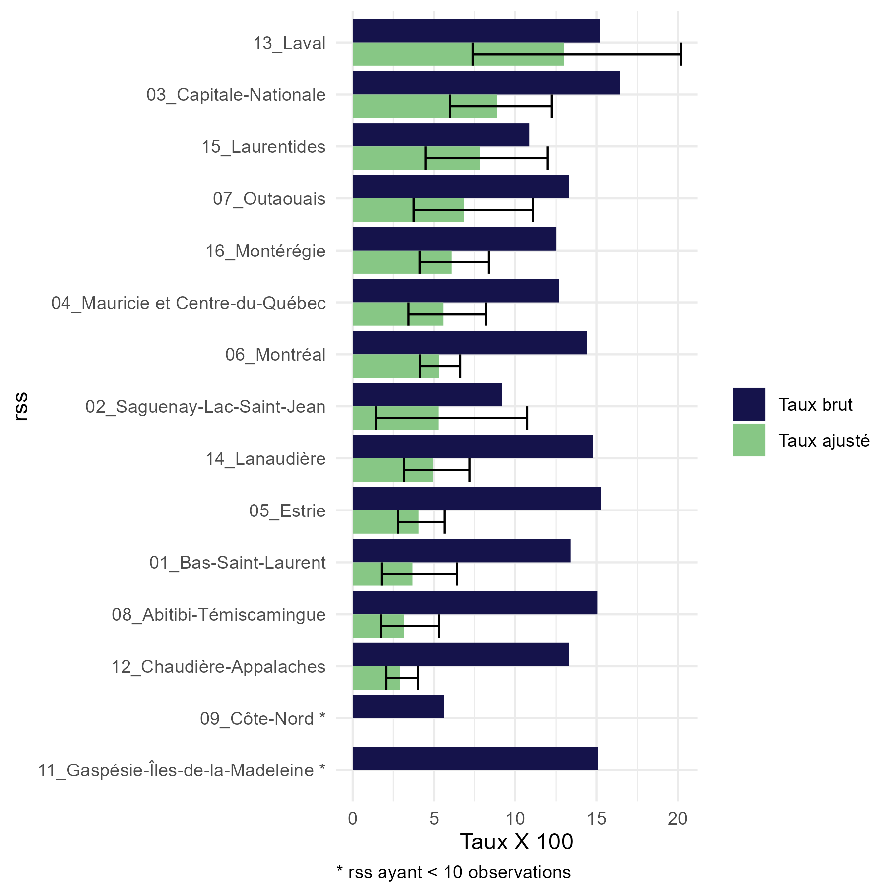
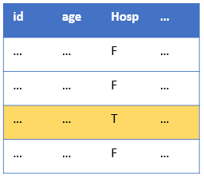
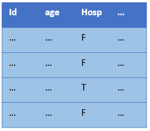

```{r setup, include=FALSE}
knitr::opts_chunk$set(echo = FALSE,error=T, warning=T,fig.align = "center", fig.border="none") 

```

```{r load-packages, include= F}
library(standardisation)
library(tidyverse)
```

# Introduction

Le package **standardisation** comprend un ensemble de fonctions conçues pour la standardisation et la transformation des données. La standardisation permet des comparaisons plus fiables entre différentes populations en ajustant les taux de maladie, de mortalité ou d'autres indicateurs en tenant compte des différences d'âge, de sexe, ou d'autre variables. Ce package permet la standardisation en ajustant par une population de référence soit interne, soit externe. De plus, la fonction agregation permet de convertir les données individuelles ou partiellement agrégées en un format propice à la standardisation.

<br>


## Description courte

Le package comprend trois fonctions d'analyse et deux fonctions de visualisation :

`agregation()` : Cette fonction est conçue pour transformer des données individuelles ou partiellement agrégées en un format adapté pour les fonctions de standardisation. Elle peut gérer une large gamme de types et de formes de données, garantissant une flexibilité pour répondre à divers besoins d'agrégation de données.

Il convient de noter que les données entièrement agrégées qui répondent déjà aux exigences des fonctions de standardisation peuvent contourner cette étape et passer directement à la standardisation.

`plot.agregation()` : Cette fonction visualise un heatmap des données agrégées pour validation (il suffit d'appeler la fonction `plot` avec un objet de classe agregation).

`standardisation_interne()` : Cette fonction applique une standardisation interne à des données agrégées. Dans le processus de standardisation, elle utilise soit la somme des données d'entrée comme population de référence ou une unité spécifiée par `reference_unite`. La fonction ajuste pour des facteurs tels que le groupe d'âge, le sexe, et d'autres variables fournies

La standardisation interne peut-être directe ou indirecte.

`standardisation_externe()` : Cette fonction applique une standardisation externe à des données agrégées, prenant comme référence un fichier de données `pop_ref` réprésentant la population du Québec stratifiée par âge et sexe, à de différentes années et niveaux géographiques. Cette approche est utile lorsque les données à ajuster ne sont pas suffisamment représentatif de la population (par exemple une petite cohorte de patients ayant reçu un nouveau médicamment).

La standardisation externe doit être directe car les numérateurs de la population référence ne sont pas disponible.

`plot.standardisation_list()` : Cette fonction produit un graphiques à barres ou de points pour visualiser les résultats de la standardisation (il suffit d'appeler la fonction `plot` avec un objet de classe standardisation_list).

<br>

## Exemples d'utilisation

Voici un exemple simple d'utilisation avec des données simulées de patients hospitalisés parmi lesquels certains sont décédés (valeur "Oui" pour la variable `deces`). On veut comparer les taux de décès entre les régions (RSS) en ajustant pour l'âge. Les détails d'arguments sont précisés plus bas.

La première étape est d'agréger les données brutes.

```{r echo=T, collapse=T}
agr<-agregation(donnees = donnees_sim %>% filter(annee == "2022"), 
                   unite = "rss",
                   age = "age",
                   age_cat_mins = c(0,50,60,70),
                   type_num = "filtré",
                   num_filtre_expression = "deces == 'Oui' ",
                   type_denom = "total interne")
```

<br>

On peut valider les résultats de l'agrégation rapidement en les visualisant.

```{r echo=T, fig.show='hide', collapse=T}
plot(agr)
```

```{r, fig.align="center",out.width = "70%", fig.border = "none", echo=FALSE}
knitr::include_graphics("plot_agregation.PNG")
```


<br>

Une fois agrégée, les données peuvent être standardisées, dans cet exemple on fait une standardisation interne et indirecte. Les fonctions de standardisation retiennent les arguments de la fonction d'agrégation pour faciliter la standardisation.

```{r echo=T, collapse=T}
st_i<-standardisation_interne(donnees = agr,
                            methode = "indirecte")
```

On peut vérifier les résultats de la standardisation (l'autre objet "Details" contient les strates d'agrégation). Les intervalles de confiance sont issues du package `PHEIndicatormethods`.

```{r echo=T, collapse=T}
st_i
```

<br>

Il est aussi possible de visualiser les résultats de standardisation.

```{r echo=T, fig.show='hide', collapse=T}
plot(st_i)

```

```{r, fig.align="center", out.width = "70%",fig.border = "none", echo=FALSE}

```

Et voici ici un exemple d'une standardisation externe et directe. Notez que les groupes d'âges doivent être spéficiés de nouveau pour permettre la correspondance avec le dataframe de référence externe. La valeur 99 pour ref_externe_code fait référence au niveau géographique de l'ensemble du Québec.

```{r echo=T,collapse=T}
st_e<-standardisation_externe(donnees = agr,
                            ref_externe_annee = 2022,
                            ref_externe_code = "99",
                            multiplicateur = 100)

st_e
```


Et la visualisation.

```{r echo=T, fig.show='hide', collapse=T, warning=FALSE}
plot(st_e)

```
```{r, fig.align="center", out.width = "70%",fig.border = "none", echo=FALSE}

```
<br>
<br>

# Description détaillée

Regardons plus en détail les trois fonctions.

## `agregation`

### Regroupement d'âge

La fonction `agregation()` est surtout utile lorsqu'il faut regrouper des valeurs d'âge continu et compter la somme par groupe. Pour se faire, il faut spécifier l'argument `age_cat_mins` (et si nécessaire `age_filtre_max`). Cet argument prend comme valeur un vecteur des âges minimum de chaque groupe, par exemple, c(18,40,60,80). Cet exemple produirait les groupes d'âge suivant: [18, 39), [40, 59), [60, 79), et [80, Inf). La première valeur du vecteur crée un filtre sur les données en excluant les patients de moins de 18 ans (une valeur de 0 n'applique pas de filtre). Par défaut, l'âge maximale est Inf, donc aucun filtre n'est appliqué pour la dernier groupe d'âge. Si nécessaire, une valeur peut être spéficifié pour `age_filtre_max` qui permettrait des exclure les patients en haut de cet âge (la valeur est un maximum "exclusif").

<br>

### Structure des données

Bien que l'utilisation typique de cette fonction est d'agréger des données individuelles ayants des valeurs d'âges continus, la fonction offre aussi de la flexibilité dans la manière dont les numérateurs et les dénominateurs sont identifiés et calculés. Cependant, il est important de noter que toutes les combinaisons des types de numérateurs (`type_num`) et de dénominateurs (`type_denom`) ne sont pas autorisées.

#### **Numérateurs**

Il y a trois façons d'identifier les numérateurs dans un ensemble de données :

1.  `type_num = "filtré"` : Une expression logique est spécifié pour identifier quelles lignes dans un ensemble de données individuelles doivent être comptées. Cette option nécessite l'argument `num_filtre_expression` (par exemple, `num_filtre_expression  = "hospitalisation == TRUE"` ).

```{r, out.width = "20%", fig.align="center", fig.border = "none", echo=FALSE}

```

1.  `type_num = "total interne"` : L'ensemble de données individuelles fourni est compté comme numérateur. Par exemple dans un cas où une extraction de données ne représente que les patients à analyser.

```{r, out.width = "20%", fig.align="center", fig.border = "none", echo=FALSE}
knitr::include_graphics("image_num_total.PNG")
```

1.  `type_num = "colonne agrégée"` : Les données sont partiellement agrégées et une colonne spécifie les décomptes des numérateurs. Cette option nécessite l'argument `numerateur_agr_col.`

```{r, out.width = "20%", fig.align="center", fig.border = "none", echo=FALSE}
knitr::include_graphics("image_num_col.PNG")
```

<br>

#### **Dénominateurs**

De même, il y a trois façons d'obtenir les dénominateurs :

1.  `type_denom = "total_interne"` : L'ensemble de données individuelles fourni est compté comme dénominateur.

```{r, out.width = "20%", fig.align="center", fig.border = "none", echo=FALSE}

```

1.  `type_denom = "externe"` : Un ensemble de données de population externe agrégé , le fichier `pop_ref`, est utilisé comme dénominateurs. Cette option nécessite l'argument `denom_externe_type_unite`. Si ce dernier est "Régional" (au lieu de "Annuel"), il faut préciser une valeur pour `denom_externe_annee` et `denom_externe_geo`. Un dernier argument facultatif est `denom_externe_regroupement_unite` (voir plus bas).

```{r, out.width = "20%", fig.align="center", fig.border = "none", echo=FALSE}
knitr::include_graphics("image_denom_ext.PNG")
```

1.  `type_denom = "colonne_agrégée"` : Les données sont partiellement agrégées et une colonne spécifie les décomptes des dénominateurs. Cette option nécessite l'argument `denominateur_agr_col.`

```{r, out.width = "20%", fig.align="center", fig.border = "none", echo=FALSE}
knitr::include_graphics("image_denom_col.PNG")
```

<br>

#### **Combinaisons autorisées**

Toutes les combinaisons de `type_num` et `type_denom` ne sont pas autorisées. Les combinaisons autorisées sont les suivantes :

-   `type_num = "filtré"` peut être associé avec `type_denom = "total_interne"` ou `type_denom = "externe"`.

-   `type_num = "total_interne"` ne peut être utilisé qu'avec `type_denom = "externe"`.

-   `type_num = "colonne agrégée"` peut être associé avec `type_denom = "colonne_agrégée"` ou `type_denom = "externe"`.

```{r, out.width = "90%", fig.align="center", fig.border = "none", echo=FALSE}
knitr::include_graphics("image.PNG")
```

<br>

#### **Exemple de regroupement d'unité**

Dans un scénario où l'agrégation se fait avec un dénominateur externe et que les unités du numérateur représentent de regroupement d'unités (par exemple "Régions du nord" pour les RSS 10, 18 et 19 ou "2020 à 2022" pour les années 2020, 2021 et 2022), l'argument `denom_externe_regroupement_unite` permet de effectuer une correspondance entre ces regroupements d'unités et les unités du fichier `pop_ref`. Les valeurs acceptées pour cet argument doit être en format de liste où les noms des éléments correspondent aux valeurs regroupés de `donnees` et les valeurs de chaque élément représente les unités de `pop_ref` à regrouper.

Prenons un exemple où les RSS de Montréal et Laval et de Capitale-Nationale et Chaudières-Appalaches sont regroupés dans les mêmes zones.

```{r echo=T, collapse=T}
#création de données avec zones 
donnees_regroup <- donnees_sim %>% filter(annee == 2021)
donnees_regroup <- donnees_regroup %>% 
  mutate(zone=case_when(rss_code %in% c("06","13") ~ "Mtl_Laval",
                        rss_code %in% c("03","12") ~ "C.N._Ch-Ap.",
                        T ~ rss_code))

#agrégation avec regroupement de dénominateurs externe
agr_avec_regroup<-agregation(donnees = donnees_regroup,
                   unite = "zone",
                   age="age",
                   age_cat_mins = c(0,75),
                   type_num= "filtré",
                   num_filtre_expression="deces == 'Oui' ",
                   type_denom="externe",
                   denom_externe_annee=2021,
                   denom_externe_geo="RSS",
                   denom_externe_type_unite= "Régional",
                   denom_externe_regroupement_unite=
                     list("Mtl_Laval"=c("06","13"),
                          "C.N._Ch-Ap." = c("03","12"))
)

agr_avec_regroup
```

<br>

<br>

Avec les données agrégés, on peut maintenant passer à la standardisation. Si vous aviez des données déjà agrégées, il faut s'assurer que toutes les strates sont inclues, même celles qui ont 0 comme numérateur.

<br>

## `standardisation_interne`

La standardisation interne permet de prendre comme référence la population de l'ensemble de données, évitant alors le besoin d'apparier des données de référence externe. Il est aussi possible dans la standardisation interne de sélectionner une unité de l'analyse (par exemple, une région ou une année) comme référence. Dans cet exemple on reprend celui décris plus haut mais en spécifiant le RSS de Montréal ("06_Montréal" ) comme référence.

```{r echo=T, collapse=T}
st_i<-standardisation_interne(donnees = agr,
                              reference_unite = "06_Montréal",
                              methode = "indirecte",
                              multiplicateur = 100)
```

Dans l'élement "Resultats" on contate que le ratio pour Montréal est de 1, car le nombre observés de cas est le même que le "expected" étant donné que c'est la référence.

```{r echo=T, collapse=T}

st_i
```

<br>

<br>

## `standardisation_externe`

La standardisation externe permet d'ajuster les unités d'analyse (régions ou années) en prenant comme référence le fichier de population du Québec, `ref_pop` . À noter que seulement l'ajustement par âge et sexe est possible dans la standardisation externe car les taux de référence ne sont pas disponibles pour d'autres variables.

-   `ref_externe_annee` . Le fichier `pop_ref` contient des données de population datant de 1996 jusqu'à 2041 (projections). Il faut sélectionner une année comme référence.

-   `ref_externe_code`. Le fichier `pop_ref` contient des données pour l'ensemble du Québec, ou par différents niveaux géographiques (RSS, RLS, RTS). Le code "99" sert à sélectionner l'ensemble du Québec comme référence. Les codes de RSS sont une chaînes de 2 caractères, les RTS sont de 3 caractères, et les RLS sont de 4 caractères.

Le prochain exemple démontre un scénario où on veut comparer des années, en ajustant avec une année de référence externe. Pour ce faire nous allons refaire l'agrégation des données. Pour l'agrégation nous allons prendre un dénominateur externe. Cela permettra d'illustrer la nuance entre l'utilisation du fichier de population externe pour les dénominateurs et la référence. Par exemple lorsque l'unité est une année et on veut un dénominateur externe (`type_denom` = "externe"), il faut préciser `denom_externe_type_unite` = "Annuel". Dans ce cas il n'est pas nécessaire de préciser une année pour `denom_externe_annee` un niveaux de géographie `denom_externe_geo` (dans cette situation ce sont les populations annnuelles de l'ensemble du Québec qui servent comme dénominateurs).

```{r echo=T, collapse=T}

agr_ext<-agregation(donnees = donnees_sim , 
                unite = "annee",
                age = "age",
                age_cat_mins = c(18,65,85),
                sexe="sexe",
                type_num = "filtré",
                num_filtre_expression = "deces == 'Oui' ",
                type_denom = "externe",
                denom_externe_type_unite = "Annuel")

agr_ext
```

Maintenant nous poursuivons avec une standardisation externe de ces données. Cette fois il faut préciser une année pour `ref_externe_annee` car il n'y a qu'une seule année qui sert comme référence. La valeur "99" pour `ref_externe_code` précise que c'est l'ensemble du Québec qui sert comme référence (d'autres valeurs sont permises si on veut une région particulière comme référence).

Ici le multiplicateur est beaucoup plus grand pour permettre des taux plus facile à interpreter.

```{r echo=T, collapse=T}

st_ext<-standardisation_externe(donnees = agr_ext,
                            ref_externe_annee = 2022,
                            ref_externe_code = "99",
                            multiplicateur = 100000)

plot(st_ext, Annuel=T)
```

